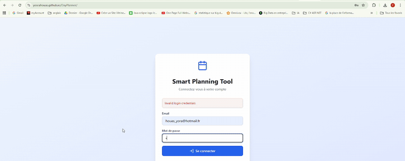

# 📅 React + Vite – DayPlanner



Welcome to **DayPlanner**, a smart and intuitive daily planning web app designed to help you organize your day efficiently, visualize your tasks, and track your total working time in real time.  
Developed in **3 days** and published on **November 8, 2025**.

---

## 🚀 Built With

- **React.js**  
- **Vite**  
- **TypeScript**  
- **Tailwind CSS**  
- **Supabase** (for database management if configured)

---

## ✨ Features

- Create, edit, and delete tasks easily  
- Categorize by **priority** (High / Medium / Low) and **type** (Work, Development, Communication, etc.)  
- View tasks in **list** or **timeline** mode  
- Automatic **total duration calculation**  
- Clean, modern, and **responsive UI**  

---

## 💡 Installation & Execution

Clone the repository:

```bash
git clone https://github.com/yosraHouas/DayPlanner.git
cd DayPlanner
```

Install dependencies:

```bash
npm install
```

Run the app in development mode:

```bash
npm run dev
```

Your app will be available at the URL shown in your console (usually [http://localhost:5173](http://localhost:5173)).

---

## 🎯 Objective

This project was built to provide an elegant and efficient way to plan your day, practice modern front-end architecture, and apply best UI/UX and code organization practices.

---

## 🌐 Live Demo

👉 [Try the app online here](https://yosrahouas.github.io/DayPlanner/)

---

👩‍💻 *Created with passion by Yosra Houas*
